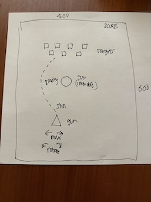
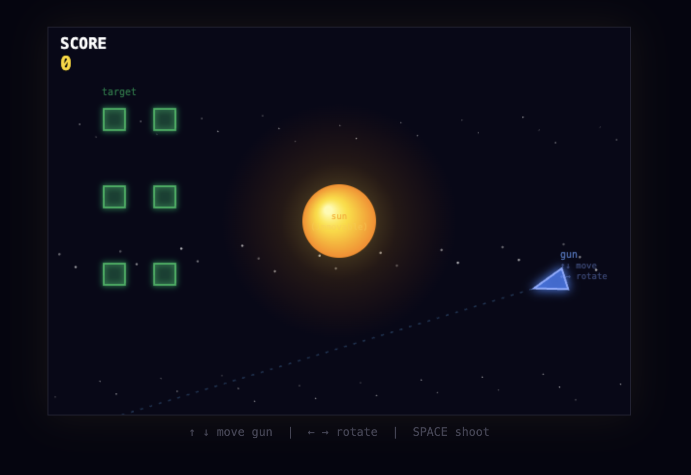
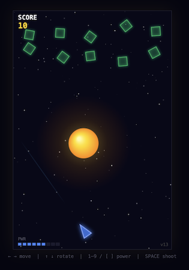

This is a quick exercise to see if [Claude](http://claude.ai) could interpret an image of a rough "napkin" sketch for a game and then implement it.

tldr; It worked amazingly fast! [Play Claude Sun Gravity Game now](https://rozim.github.io/ClaudeSunGravityGame/).

All I did was create (CLAUDE.md) and (GOAL.md) and the key is the first line in GOAL.md -- there was no textual explanation of the game objects or
mechanics, just the messy handwriting on the sketch.

```
Carefully look at the image in based on the rough sketch sketch.jpeg and implement a game based on this.

If you do not understand the idea then ask questions.
```

Initial sketch as input to Claude (click to enlarge).

[](sketch.jpeg)(https://rozim.github.io/ClaudeSunGravityGame/sketch.jpeg)

After 10 minutes it had a very v1 that really just had the orientation wrong visually, and needed gravity to be tuned.
[](https://rozim.github.io/ClaudeSunGravityGame/v1-10minutes-small.png)

After a total of 45 minutes, gravity was tuned, more controls were added, and it intelligently added multiple sounds given just a terse instruction of "add sound".

[](https://rozim.github.io/ClaudeSunGravityGame/v13-45minutes.png)

It never asked me questions, maybe the concept was simple enough.

Go ahead, it's safe, [Play Claude Sun Gravity Game now](https://rozim.github.io/ClaudeSunGravityGame/).
